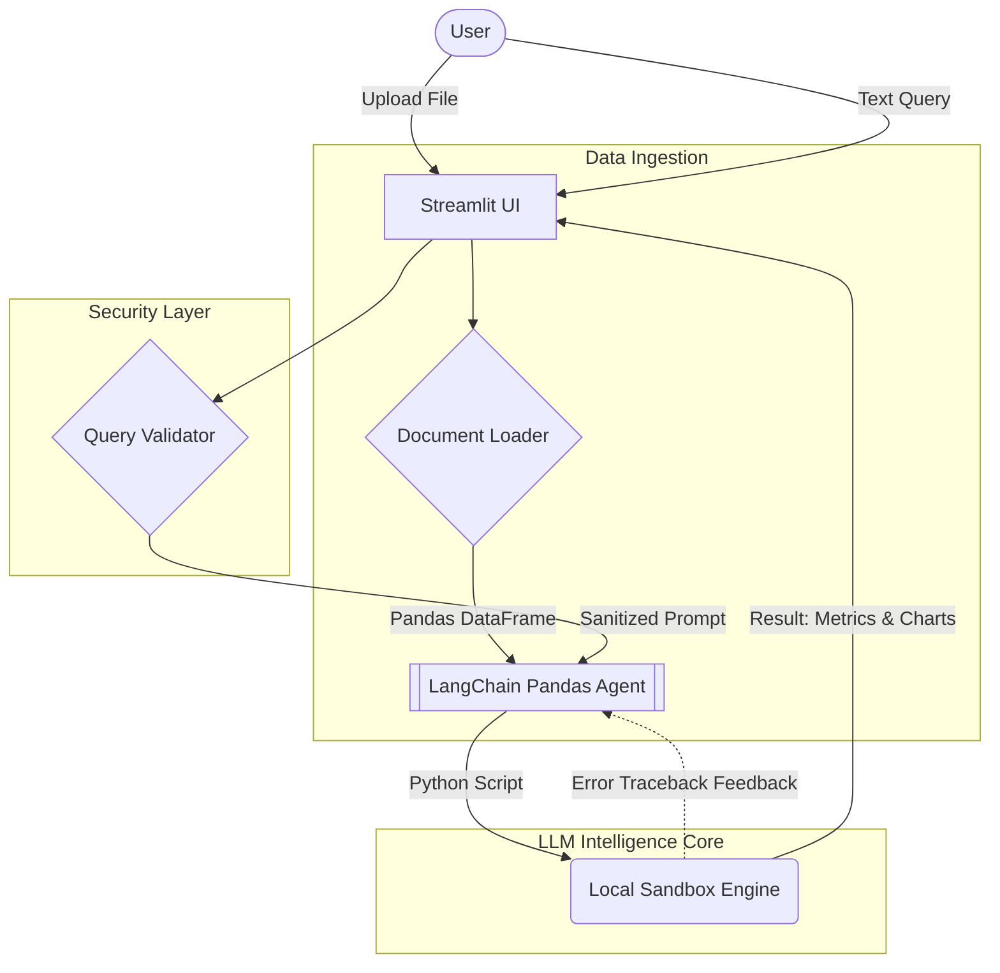
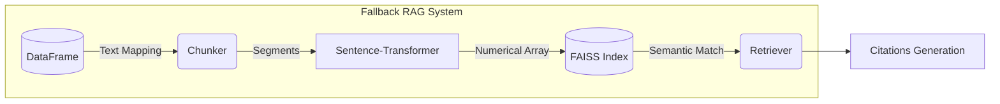

# 🤖 AI Data Analyst Chatbot – The Complete Guide


Welcome to the definitive and comprehensive documentation for the **AI Data Analyst Chatbot**. This document contains every single detail about the project—from its core philosophy to the intricate, code-level execution lifecycle of the tool matrix.

---

## 📑 Table of Contents
1. [Executive Summary / Problem Statement](#1-executive-summary--problem-statement)
2. [Complete System Lifecycle](#2-complete-system-lifecycle-start-to-finish)
3. [Deep Dive: Project Directory & Modules](#3-deep-dive-project-directory--modules)
4. [Software Architecture & Data Flow Diagrams](#4-software-architecture--data-flow-diagrams)
5. [Code-Level Execution Mechanics](#5-code-level-execution-mechanics)
6. [Technology Definitions](#6-technology-definitions)
7. [Comprehensive Setup & Execution Guide](#7-comprehensive-setup--execution-guide)
8. [Example Queries & Capabilities](#8-example-queries--capabilities)
9. [Limitations, Bottlenecks & Future Roadmap](#9-limitations-bottlenecks--future-roadmap)

---

## 1. Executive Summary / Problem Statement

In modern business environments, raw tabular data (CSV, Excel) is abundant, but actionable insights are trapped behind steep learning curves requiring SQL, Pandas, or BI tool expertise. 

The **AI Data Analyst Chatbot** serves as a translator: it allows non-technical users to speak to their data in plain English. Over the course of the project, we've developed an architecture that loads secure, local data, applies generative-AI models (powered by LLMs like Gemini/OpenAI) to write and execute python code on the fly, and returns visualized analytics directly to a web browser.

---

## 2. Complete System Lifecycle (Start to Finish)

When a user interacts with the project, this is the exact, uninterrupted workflow from start to finish:

1. **Initialization:** User boots the system via Streamlit. The application reads limits and allowed extensions from `config.py` and loads API Keys from `.env`.
2. **Data Ingestion:** User drags a `.csv` or `.xlsx` into the sidebar.
3. **Parsing & Validation:** `document_loader.py` securely bridges the bitstream into a Pandas `DataFrame`. It catches file corruption (`ParserError`) inherently.
4. **Autonomous Profiling:** The UI instantly tells the user exactly how many rows/columns exist and renders a DataFrame preview.
5. **RAG Pre-computation (Background):** While profiling, `chunker.py` transforms the tabular rows into strings, readying them for FAISS Vector Search if a semantic lookup is needed.
6. **Query Ingress:** User types "Plot total sales grouped by region."
7. **Query Sanitization:** `validator.py` checks if the query length exceeds the maximum token config buffer to defend against Prompt Injection and Token Overflows.
8. **LLM Orchestration:** `app.py` spins up the LangChain `create_pandas_dataframe_agent`. It embeds the DataFrame schema into a system prompt alongside the user's query.
9. **Code Synthesis & Execution:** The LLM hallucinates Python Pandas/Plotly code to solve the query. An internal execution sandbox runs this code via Python's AST (`exec()`).
10. **Error Self-Correction Loop:** If the LLM spells a column name wrong and Python throws a `KeyError`, the Agent receives the traceback, rewrites its own code fixing the typo, and runs it again autonomously!
11. **Output Rendering:** The agent produces either a Text String, a Pandas Dataframe, or a Plotly chart, which is rendered natively on Streamlit.
12. **Session Lifecycle:** Once reloading, the in-memory data object is securely destroyed.

---

## 3. Deep Dive: Project Directory & Modules

Every file in this project is strictly isolated to handle one specific layer of the architecture.

```text
📁 AI_DATA_ANALYST_CHATBOT1
│
├── app.py                   # The Front-Controller. Glues UI, Agent, and Data layers together.
├── config.py                # Single Source of Truth for Magic Numbers (Max lengths, Allowed files)
├── test_validation.py       # Python Unit tests to prevent breaking changes in validation logic
├── requirements.txt         # All pip dependencies
├── .env.example             # Security template 
│
└── 📁 utils                 # Engine Room
    ├── __init__.py          # Marks folder as a Python Package
    ├── chunker.py           # Uses Langchain standard chunkers to split DataFrame text rows.
    ├── document_loader.py   # Pandas wrapper blocking EmptyDataError & Bad Extensions.
    ├── embedder.py          # Uses `sentence-transformers` for dense vector creation.
    ├── retriever.py         # Manages the FAISS index for high-speed similarity search.
    └── validator.py         # Prevents empty strings, massive strings, or trailing whitespaces.
```

---

## 4. Software Architecture & Data Flow Diagrams

### High-Level Component Flow


### RAG (Retrieval-Augmented Generation) Pipeline
If tabular mathematical processing is insufficient, the application utilizes textual extraction.



---

## 5. Code-Level Execution Mechanics

### 1. The LangChain Pandas Agent (`app.py`)
The most complex mechanism in the tool is:
```python
agent = create_pandas_dataframe_agent(
    llm, df, verbose=True, allow_dangerous_code=True, handle_parsing_errors=True
)
```
**What does this do?** 
It forces the LLM into a `ReAct` (Reason+Act) loop. The LLM is given access to a "Tool" (Python Interpreter). It gets a prompt describing the columns and head of `df`. Based on the query, it generates `df.groupby(...).sum()`, writes it via Python `exec()`, reads the console output, processes the conclusion, and stops.

### 2. Validation Constraints (`utils/validator.py`)
```python
if len(sanitized) > MAX_QUERY_LENGTH:
    raise ValueError(...)
```
Protects the API budget. If a user pastes a 10,000-word essay into the Streamlit chat box, the local python environment stops it instantly before sending it up to the API, saving extreme token costs.

### 3. Fault Tolerant Parsing (`utils/document_loader.py`)
By isolating `pd.read_csv()` inside `try/except` blocks specifically checking for `pd.errors.EmptyDataError`, we ensure that a user uploading an empty file gets a polite Streamlit UI popup instead of the entire server crashing.

### 4. Semantic Search & Citations (RAG Expansion in `app.py`)
When you see the **"View Retrieved Context / Citations"** box with text like `Semantic Match: service_type, is_mix_service...`, this is the backend RAG (Retrieval-Augmented Generation) system at work. Upon file upload, the dataset is segmented into "chunks" and converted into vector embeddings by FAISS. When you ask a question, the app scans these embeddings to find the most mathematically similar chunk of text (often the CSV column headers or specific rows). This context is pulled into the background to help the AI understand your data structure. The expandable UI box simply surfaces this raw, retrieved text snippet to demonstrate the internal vector retrieval process to the user.

---

## 6. Technology Definitions

| Component | Role | Why We Chose It over Alternatives |
| :--- | :--- | :--- |
| **Streamlit** | Interface | Eliminates the need for HTML/CSS/React. Allows building UI purely in Python. |
| **Pandas** | Tabular Data | Most deeply supported array/table tool in the ML ecosystem. Native integration with LLMs. |
| **LangChain** | Execution Orchestrator | Raw LLM API calls do not know how to "Run Code". Langchain gives models the "Tools" allowing them to execute code. |
| **Gemini / OpenAI** | Intelligence | The models used to parse the English query into highly accurate Python script. |
| **Plotly** | Visualization | Unlike Matplotlib which generates static PNGs, Plotly generates dynamic JS graphs you can zoom and hover over. |
| **FAISS** | Vector Search | Because we only need localized, in-memory semantic lookup, FAISS is 100x lighter/faster than spinning up Pinecone or Chroma databases. |

---

## 7. Comprehensive Setup & Execution Guide

### Prerequisites
You strictly need **Python 3.10** or higher installed.

### Step 1: Environment Isolation
We use virtual environments (`venv`) so project dependencies don't corrupt your system python folder.
```bash
git clone https://github.com/mstar89/AI_DATA_ANALYST_CHATBOT1.git
cd AI_DATA_ANALYST_CHATBOT1

# Windows
python -m venv venv
venv\Scripts\activate

# macOS / Linux
python -m venv venv
source venv/bin/activate
```

### Step 2: System Installations
Install all pip dependencies.
```bash
pip install -r requirements.txt
```
*Note: If you run into issues with `faiss`, you may explicitly run `pip install faiss-cpu`.*

### Step 3: Security File Injection
Never upload `.env` to GitHub. Copy the template and add your LLM API Key (Ensure it matches whether you use GOOGLE_API_KEY for Gemini, or OPENAI_API_KEY).
```bash
cp .env.example .env
```
Open `.env` in any text editor and fill your key.

### Step 4: Health Check validation
Before running the main server, ensure the internal functions operate exactly as designed.
```bash
python test_validation.py
```

### Step 5: Booting the Server
```bash
streamlit run app.py
```
Streamlit will launch a local network port (Usually `localhost:8501`). Your default browser will automatically open and point to it.

---

## 8. Example Queries & Capabilities

Here is what the project is capable of doing once booted up and handed a dataset (like a Sales or HR dataset):

**A. Profiling Tasks**
- *"Give me a summary of the dataset."*
- *"Are there any missing or null values in this file?"*
- *"What is the standard deviation of the Salary column?"*

**B. Data Manipulation Tasks**
- *"Filter the data to only show users who live in New York and are older than 30."*
- *"What is the total revenue grouped by Product Category?"*

**C. Automated Charting**
- *"Plot a bar chart showing the sum of sales per region."*
- *"Create a scatter plot of Age versus Income."*
- *"Generate a correlation matrix heatmap for all numeric variables."*

*(Notice you never have to type `import matplotlib` or `df.groupby()`. The LLM writes it silently in the background).*

---

## 9. Limitations, Bottlenecks & Future Roadmap

**Present Limitations:**
- **Local Sandbox Confinement:** The parameter `allow_dangerous_code=True` executes Python `ast.exec()` directly on your local machine. If a malicious user queried *"Format my hard drive"*, the LLM *could* attempt to write an `os.system` script. While highly unlikely with standard models, for enterprise deployment, this MUST be routed to an isolated docker pod or systems like **E2B Sandboxes**.
- **Context Token Windows:** If you upload a dataset with 5,000 columns, the LLM will fail because inputting 5,000 column names into the "System Prompt Prompt Context" will overflow the context window (e.g. going over 8k/128k limits).
- **In-Memory Volatility:** Streamlit re-runs scripts on every widget click. While cached, large files directly consume system RAM via Pandas.

**Future Roadmap:**
- **Polars / PySpark Migration:** Swapping pandas for Polars to handle Big Data (Data passing 5GB+ in local RAM).
- **Persistent Conversational Memory:** Allowing the Chatbot to remember answers from 5 queries ago (Current structure treats each prompt autonomously via the data frame agent state wrapper).
- **Direct Database Connectors:** Bypass CSV files entirely by having Langchain execute standard `psycopg2` SQL queries directly on production databases (Supabase, AWS).
